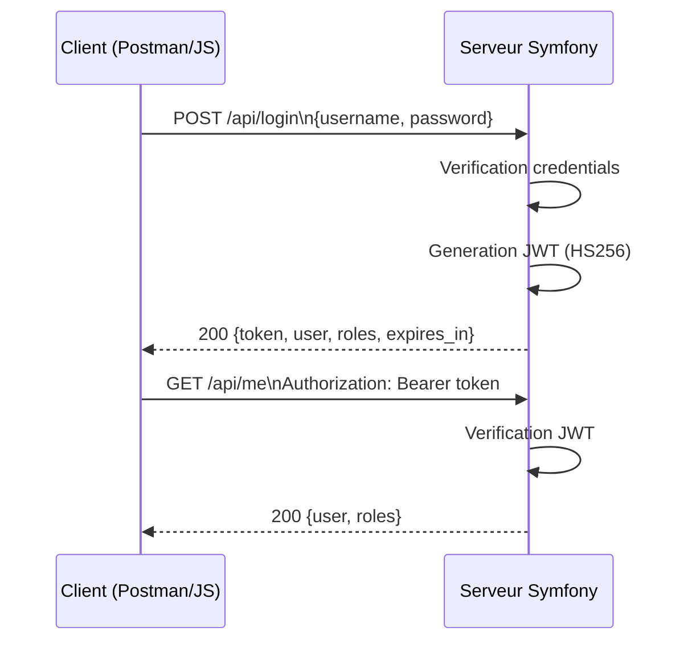
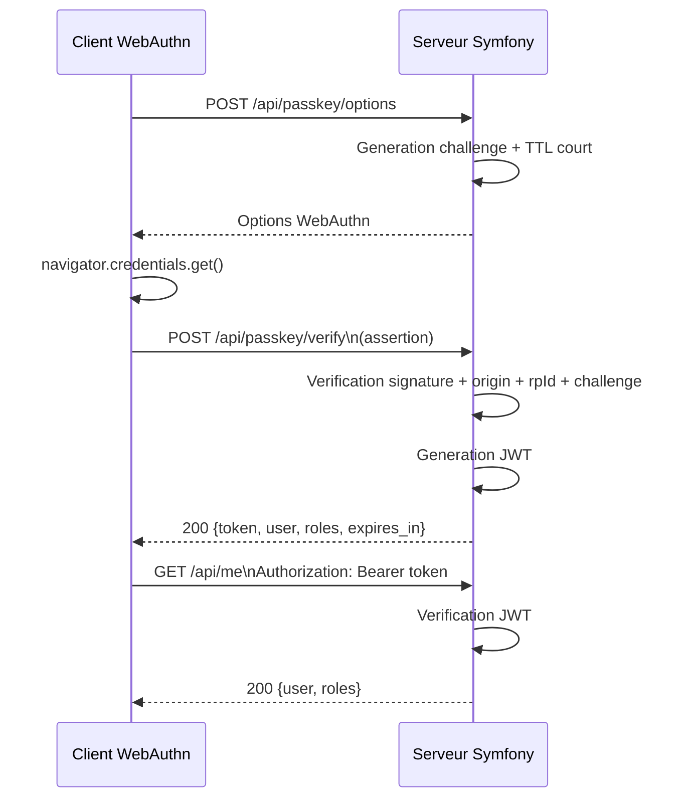

# Annexes Techniques - JWT + Passkeys

Auteur: Sofiene Ben Ahmed

Contexte projet: Mini Projet FIA3-GL - Application Web de Gestion de Reservations d'Evenements

Date: 22 fevrier 2026

## Resume

Ce document est une version corrigee et exploitable des annexes techniques JWT + Passkeys.
Il est aligne avec l'implementation Symfony actuelle du projet:

- Authentification web (form login)
- Authentification API par JWT
- Endpoint JWT actif: /api/login
- Endpoint protege de test: /api/me
- Base de donnees cible: MySQL/MariaDB

Les sections Passkeys sont definies comme cible d'implementation (phase suivante) avec endpoints proposes et exigences de securite.

## Table des matieres

1. Annexe A - Schema de flux d'authentification
2. Annexe B - Glossaire technique detaille
3. Annexe C - Tableaux de reference
4. Annexe D - Configuration Docker complete
5. Annexe E - Depannage avance
6. Annexe F - Ressources et references

---

## 1. Annexe A - Schema de flux d'authentification

### 1.1 Flux actuel (deja implemente): Login API -> JWT



### 1.2 Flux cible (a realiser): Passkey -> JWT



### 1.3 Detail des etapes Passkeys

| Etape | Action                   | Details techniques                                              |
| ----- | ------------------------ | --------------------------------------------------------------- |
| 1     | Requete options          | Le client appelle /api/passkey/options                          |
| 2     | Challenge                | Le serveur genere un challenge cryptographique aleatoire unique |
| 3     | Verification utilisateur | Biometrie, FaceID ou PIN selon userVerification                 |
| 4     | Signature                | La passkey signe le challenge avec la cle privee                |
| 5     | Verification serveur     | Controle avec la cle publique stockee                           |
| 6     | Emission JWT             | Claims minimales: sub, roles, iat, exp                          |
| 7     | Requetes API             | Header Authorization: Bearer token                              |

---

## 2. Annexe B - Glossaire technique detaille

- RP (Relying Party): service qui s'appuie sur WebAuthn (votre app Symfony).
- Attestation: preuve optionnelle sur l'authentificateur materiel.
- Resident Key: passkey stockee sur appareil (souvent synchronisee cloud).
- User Verification: niveau de verification locale required/preferred/discouraged.
- Claim JWT: information dans le token, par exemple iss, sub, aud, exp, iat.
- Refresh Token: token longue duree pour renouveler l'access token.
- Challenge: valeur aleatoire anti-rejeu, unique et a duree de vie courte.
- Credential ID: identifiant d'une passkey cote serveur.
- Origin: protocole + domaine + port, doit correspondre strictement.
- Stateless: pas de session serveur persistante, verification par signature JWT.

---

## 3. Annexe C - Tableaux de reference

### 3.1 Codes de reponse HTTP

| Code | Signification         | Cas d'usage                                     |
| ---- | --------------------- | ----------------------------------------------- |
| 200  | OK                    | Login reussi, token renvoye                     |
| 201  | Created               | Credential/passkey enregistree                  |
| 400  | Bad Request           | Payload invalide ou champs manquants            |
| 401  | Unauthorized          | Identifiants invalides ou token absent/invalide |
| 403  | Forbidden             | Authentifie sans role requis                    |
| 409  | Conflict              | Username ou credential deja existant            |
| 429  | Too Many Requests     | Trop de tentatives de login                     |
| 500  | Internal Server Error | Erreur serveur                                  |

### 3.2 Algorithmes cryptographiques recommandes

| Usage                    | Recommandation     | Notes                                  |
| ------------------------ | ------------------ | -------------------------------------- |
| JWT (simple)             | HS256              | Cle secrete robuste (>= 32 caracteres) |
| JWT (production avancee) | RS256 ou ES256     | Rotation de cles privee/publique       |
| Mots de passe            | Argon2id ou bcrypt | Cout adapte                            |
| TLS                      | TLS 1.3            | Chiffrement fort                       |
| WebAuthn                 | ECDSA/EdDSA        | Selon authentificateur                 |

### 3.3 Durees de vie recommandees

| Element                | Duree recommandee |
| ---------------------- | ----------------- |
| Access Token JWT       | 15 min a 1 h      |
| Refresh Token          | 7 a 30 jours      |
| Challenge WebAuthn     | 2 a 5 min         |
| Inactivite session web | 30 min a 2 h      |

---

## 4. Annexe D - Configuration Docker complete

Note: cette configuration est alignee avec le projet actuel (PHP + Nginx + MariaDB).

### 4.1 docker-compose.yml

```yaml
version: "3.9"

services:
    php:
        build:
            context: .
            dockerfile: Dockerfile
        container_name: event_php
        environment:
            APP_ENV: prod
            APP_DEBUG: "0"
            DATABASE_URL: "mysql://app:${DB_PASSWORD}@db:3306/mini_event_db?serverVersion=10.11.2-MariaDB&charset=utf8mb4"
            JWT_SECRET: "${JWT_SECRET}"
            JWT_TTL: "3600"
        volumes:
            - ./:/var/www
        depends_on:
            - db
        networks:
            - app_network

    nginx:
        image: nginx:alpine
        container_name: event_nginx
        ports:
            - "8080:80"
        volumes:
            - ./:/var/www:ro
            - ./docker/nginx/default.conf:/etc/nginx/conf.d/default.conf:ro
        depends_on:
            - php
        networks:
            - app_network

    db:
        image: mariadb:10.11
        container_name: event_db
        environment:
            MARIADB_DATABASE: mini_event_db
            MARIADB_USER: app
            MARIADB_PASSWORD: ${DB_PASSWORD}
            MARIADB_ROOT_PASSWORD: ${DB_ROOT_PASSWORD}
        volumes:
            - db_data:/var/lib/mysql
        networks:
            - app_network

networks:
    app_network:
        driver: bridge

volumes:
    db_data:
```

### 4.2 Dockerfile

```dockerfile
FROM php:8.4-fpm

RUN apt-get update \
    && apt-get install -y --no-install-recommends \
       git unzip libzip-dev libicu-dev libonig-dev libxml2-dev \
    && docker-php-ext-install pdo pdo_mysql intl opcache \
    && rm -rf /var/lib/apt/lists/*

COPY --from=composer:latest /usr/bin/composer /usr/bin/composer

WORKDIR /var/www

CMD ["php-fpm"]
```

### 4.3 Nginx (exemple minimal)

```nginx
server {
    listen 80;
    server_name localhost;

    root /var/www/public;
    index index.php;

    location / {
        try_files $uri /index.php$is_args$args;
    }

    location ~ ^/index\.php(/|$) {
        fastcgi_pass php:9000;
        fastcgi_split_path_info ^(.+\.php)(/.*)$;
        include fastcgi_params;
        fastcgi_param SCRIPT_FILENAME $realpath_root$fastcgi_script_name;
        fastcgi_param DOCUMENT_ROOT $realpath_root;
        internal;
    }

    location ~ \.php$ {
        return 404;
    }
}
```

---

## 5. Annexe E - Depannage avance

### 5.1 Problemes courants et solutions

| Probleme                                  | Cause probable                            | Solution                                    |
| ----------------------------------------- | ----------------------------------------- | ------------------------------------------- |
| 500 sur /api/login_check                  | DB non accessible ou mauvais DATABASE_URL | Verifier .env et connexion MySQL/MariaDB    |
| DomainException Provided key is too short | Secret JWT trop court                     | Definir JWT_SECRET >= 32 caracteres         |
| 401 sur /api/me                           | Token manquant, expire ou mal forme       | Ajouter Authorization Bearer token valide   |
| Commande docker inconnue                  | Docker Desktop absent                     | Installer Docker Desktop ou utiliser php -S |
| server:start inconnu                      | Symfony CLI non installee                 | Utiliser php -S host:port -t public         |

---

## 6. Annexe F - Checklist de validation rapide

Cette checklist permet de prouver rapidement que les exigences JWT + Passkeys sont operationnelles:

1. Login JWT:
    - Requete `POST /api/login` avec un utilisateur valide.
    - Reponse attendue: `200` avec `token`, `user`, `roles`, `expires_in`.
2. Route protegee:
    - Requete `GET /api/me` sans token -> `401`.
    - Requete `GET /api/me` avec Bearer token -> `200`.
3. Passkey options:
    - Requete `POST /api/passkey/options` avec `username`.
    - Reponse attendue: `200` avec `publicKey` et `challenge`.
4. Passkey verify:
    - Requete `POST /api/passkey/verify` avec assertion valide.
    - Reponse attendue: `200` avec un JWT.
5. Limitation de debit:
    - Repetitions rapides sur endpoints passkey.
    - Reponse attendue a seuil depasse: `429`.

Cette sequence peut etre capturee (Postman ou curl) et jointe en annexe de soutenance.
| Erreur migration SQL | SQL non compatible MariaDB | Adapter migration (ex: RENAME INDEX) |
| CORS en front | Headers non autorises | Configurer CORS pour Authorization et methods |
| Challenge mismatch WebAuthn | Mauvais encodage base64url | Utiliser base64url strict, challenge unique |
| Origin mismatch WebAuthn | Domaine/port non conformes | Aligner origin et rpId exacts |

### 5.2 Logs de debogage Symfony

```yaml
# config/packages/monolog.yaml
monolog:
    channels: ["webauthn", "jwt", "security"]
    handlers:
        jwt:
            type: stream
            path: "%kernel.logs_dir%/jwt.log"
            level: info
            channels: ["jwt"]
        webauthn:
            type: stream
            path: "%kernel.logs_dir%/webauthn.log"
            level: debug
            channels: ["webauthn"]
```

---

## 6. Annexe F - Ressources et references

### 6.1 Documentation officielle

- WebAuthn Level 2: https://www.w3.org/TR/webauthn-2/
- WebAuthn Level 3 (draft): https://www.w3.org/TR/webauthn-3/
- JWT RFC 7519: https://datatracker.ietf.org/doc/html/rfc7519
- JWS RFC 7515: https://datatracker.ietf.org/doc/html/rfc7515
- FIDO2 overview: https://fidoalliance.org/fido2/
- Passkeys guide: https://fidoalliance.org/passkeys/

### 6.2 Bundles et librairies

- WebAuthn Symfony bundle: https://github.com/web-auth/symfony-bundle
- WebAuthn PHP lib: https://github.com/web-auth/webauthn-lib
- Lexik JWT bundle: https://github.com/lexik/LexikJWTAuthenticationBundle
- Refresh token bundle: https://github.com/markitosgv/JWTRefreshTokenBundle
- CORS bundle: https://github.com/nelmio/NelmioCorsBundle

### 6.3 Outils de test

- WebAuthn test: https://webauthn.io/
- JWT debugger: https://jwt.io/
- Postman: https://www.postman.com/
- OWASP ZAP: https://www.zaproxy.org/

---

## Annexes de validation rapide

### A. Endpoints valides dans ce projet

- GET /
- GET, POST /login
- GET /logout
- POST /api/login_check
- GET /api/me

### B. Exemple test JWT (PowerShell)

```powershell
$body = @{ username = "user"; password = "user1234" } | ConvertTo-Json
$login = Invoke-RestMethod -Method Post -Uri "http://127.0.0.1:8010/api/login_check" -ContentType "application/json" -Body $body
$token = $login.token
Invoke-RestMethod -Method Get -Uri "http://127.0.0.1:8010/api/me" -Headers @{ Authorization = "Bearer $token" }
```

### C. Decision recommandee pour ce mini-projet

- Court terme: conserver JWT HS256 (deja fonctionnel).
- Moyen terme: ajouter refresh token rotatif.
- Phase suivante: integrer Passkeys WebAuthn avec endpoints /api/passkey/options et /api/passkey/verify.
